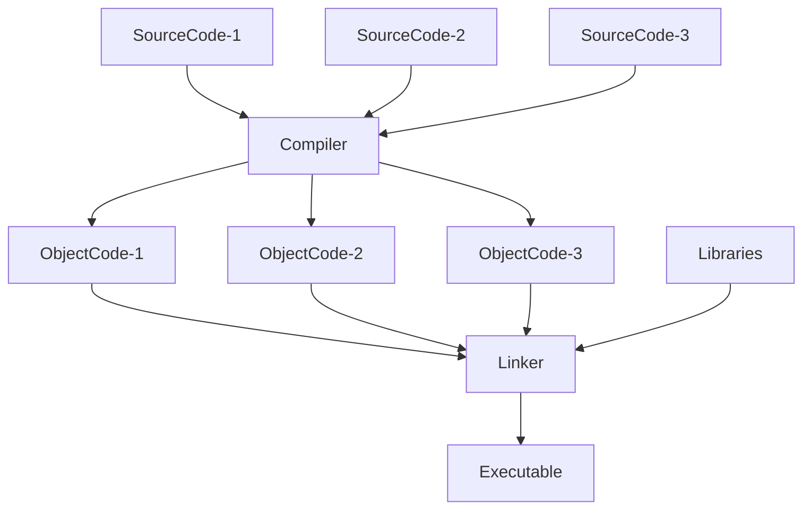

# 基本概念

## 1.环境

在 ANSI C 的任何一种实现中，存在两种不同的环境。

1. **翻译环境**（translation environment）：源代码被转换为可执行的机器指令
2. **执行环境**（execution environment）：用于实际执行代码

> 标准明确说明，这两种环境不必位于同一台机器上。

### 1.1.翻译

翻译阶段的组成：

## 2.词法规则

## 3.程序风格

## 4.总结
