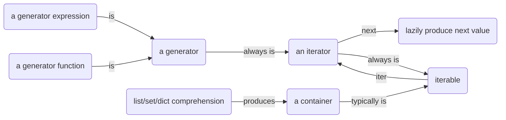
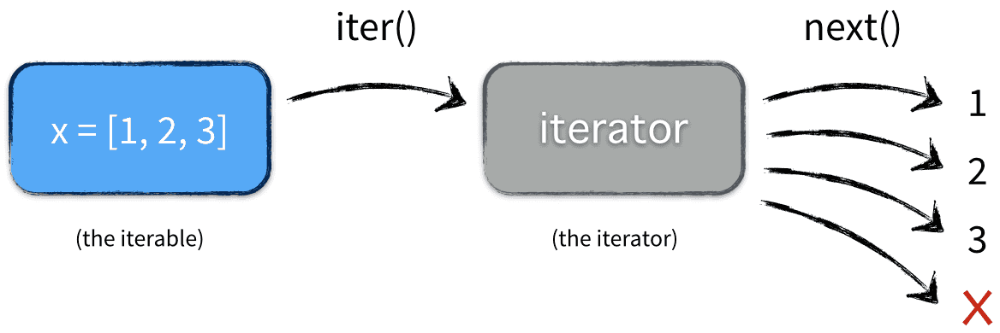

# Python 迭代器和生成器




## 容器 (container)

**容器** 是一种把多个元素组织在一起的数据结构，容器中的元素可以逐个迭代获取，可以用 `in`，`not in` 关键字判断元素是否包含在容器中。

通常这类数据结构把所有的元素存储在内存中（也有一些特例，并不是所有的元素都放在内存，比如迭代器和生成器对象），我们常用的 `string`、`set`、`list`、`tuple`、`dict` 都属于 **容器对象**。

尽管大多数容器都提供了某种方式获取其中的每一个元素，但这并不是容器本身提供的能力，而是可迭代对象赋予了容器这种能力，当然并不是所有容器都是可迭代的。

```py
# string
'h' in 'hello'
# True
'z' in 'hello'
# False
'z' not in 'hello'
# True

# list
1 in [1, 2, 3]
# True
5 in [1, 2, 3]
# False
5 not in [1, 2, 3]
# True

# set
1 in {1, 2, 3}
# True
5 in {1, 2, 3}
# False
5 not in {1, 2, 3}
# True

# tuple
1 in (1, 2, 3)
# True
5 in (1, 2, 3)
# False
5 not in (1, 2, 3)
# True

# dict
1 in {1:'one', 2:'two', 3:'three'}
# True
5 in {1:'one', 2:'two', 3:'three'}
# False
5 not in {1:'one', 2:'two', 3:'three'}
# True
```

## 可迭代对象（Iterable）

可以返回一个迭代器的对象都可以称之为 **可迭代对象**。

```py
x = [1, 2, 3]
a = iter(x)
b = iter(x)
next(a)
# 1
next(a)
# 2
next(b)
# 1
type(x)
# <class 'list'>
type(a)
# <class 'list_iterator'>
type(b)
# <class 'list_iterator'>
```

这里的 `x` 是一个可迭代对象（可迭代对象和容器一样是一种通俗的叫法，并不是指某种具体的数据类型）。`a` 和 `b` 是两个独立的迭代器，迭代器内部有一个状态，该状态用于记录当前迭代所在的位置，以方便下次迭代时获取正确的元素。

迭代器有一种具体的迭代器类型，比如 `list_iterator`，`set_iterator`。可迭代对象实现了 `__iter__()` 方法，该方法返回一个迭代器对象。

当运行代码：

```py
x = [1, 2, 3]

for ele in x:
    # ...
```

实际执行情况是：



在循环遍历自定义容器对象时，会使用 python 内置函数 `iter()` 调用遍历对象的 `__iter__()` 获得一个迭代器，之后再循环对这个迭代器使用 `next()` 调用迭代器对象的 `__next__()`。`__iter__()` 只会被调用一次，而 `__next__()` 会被调用 n 次。

## 迭代器（Iterator）

迭代器是一个带状态的对象，它能在你调用 `next()` 方法时返回容器中的下一个值，任何实现了 `__iter__()` 和 `__next__()` 方法的对象都是 **迭代器**，`__iter__()` 返回迭代器自身，`__next__()` 返回容器中的下一个值，如果容器中没有更多元素了，则抛出 `StopIteration` 异常。

迭代器与列表的区别在于，构建迭代器的时候，不像列表把所有元素一次性加载到内存，而是以一种 **延迟计算**（lazy evaluation）方式返回元素，这正是它的优点。比如列表中含有一千万个整数，需要占超过 100M 的内存，而迭代器只需要几十个字节的空间。因为它并没有把所有元素装载到内存中，而是等到调用 `next()` 方法的时候才返回该元素（按需调用 call by need 的方式，本质上 `for` 循环就是不断地调用迭代器的 `next()` 方法）。

itertools 模块里的函数返回的都是迭代器对象。为了更直观的感受迭代器内部的执行过程，我们自定义一个迭代器，以斐波那契数列为例：

> 见 [cust_iterator.py](./cust_iterator.py)

## 生成器（Generator）

普通函数用 `return` 返回一个值，还有一种函数用 `yield` 返回值，这种函数叫 **生成器函数**。函数被调用时会返回一个 **生成器对象**。*生成器其实是一种特殊的迭代器*，不过这种迭代器更加优雅，它不需要像普通迭代器一样实现 `__iter__()` 和 `__next__()` 方法了，只需要一个 `yield` 关键字。*生成器一定是迭代器（反之不成立）*，因此任何生成器也是一种懒加载的模式生成值。下面来用生成器来实现斐波那契数列的例子：

> 见 [cust_generator.py](./cust_generator.py)

上面是生成器函数，再来看下生成器的表达式，生成器表达式是列表推导式的生成器版本，看起来像列表推导式，但是它返回的是一个生成器对象而不是列表对象。

```py
x = (x*x for x in range(10))
type(x)
# <class 'generator'>
y = [x*x for x in range(10)]
type(y)
# <class 'list'>
```

我们再看看一个例子：

> 见 [cust_generator_2.py](./cust_generator_2.py)

运行结果为：

```sh
main-next: 0
func 100
main-send: 1
func None
main-next: 2
func 100
main-send: 3
func None
main-next: 4
func 100
main-send: 5
func None
Traceback (most recent call last):
  File "demo.py", line 13, in <module>
    print('main-next:', next(f))
StopIteration
```

`yield` 就是 `return` 返回一个值，并且记住这个返回的位置，下次迭代就从这个位置后（下一行）开始。`next` 方法和 `send` 方法都可以返回下一个元素，区别在于 `send` 可以传递参数给 `yield` 表达式，这时传递的参数会作为 `yield` 表达式的值，而 `yield` 的参数是返回给调用者的值。

## 总结

1. 可迭代对象（Iterable）是实现了 `__iter__()` 方法的对象，通过调用 `iter()` 方法可以获得一个迭代器（Iterator）。

2. 迭代器（Iterator）是实现了 `__iter__()` 方法和 `__next()__` 方法的对象。

3. `for...in...` 的迭代实际是将可迭代对象转换成迭代器，再重复调用 `next()` 方法实现的。

4. 生成器（Generator）是一个特殊的迭代器，它的实现更简单优雅。

5. `yield` 是生成器实现 `__next__()` 方法的关键。它作为生成器执行的暂停恢复点，可以对 `yield` 表达式进行赋值，也可以将 `yield` 表达式的值返回。

---

[Python 迭代器和生成器详解](https://zhuanlan.zhihu.com/p/341439647)
[Iterables vs. Iterators vs. Generators](https://nvie.com/posts/iterators-vs-generators/)
