# markdown

## 1. 流程图 -- mermaid

> [mermaid-js/mermaid](https://github.com/mermaid-js/mermaid)
> [mermaid (blog)](https://mermaid-js.github.io/mermaid/#/)

### 1.0.basic

- **方向**

```
graph [TB|BT|LR|RL|TD]
```

纵向：TB：从上至下；BT：从下至上；TD：从上至下
横向：LR：从左至右；RL：从右至左

- **定义框体**


- **定义连接线和子图**

连接线结构：

```
id1【连接【文本】符】id2
```

子图结构：

```
subgraph 子图名
子图内容
end
```



```mermaid
graph TB
  subgraph 实线
      A0[A] --- B0[B]
      A1[A] --> B1[B]
      A2[A] -- 描述 --> B2[B]
    end
    subgraph 虚线
      A3[A] -.- B3[B]
         A4[A] -.-> B4[B]
         A5[A] -. 描述 .-> B5[B]
    end
    subgraph 加粗线
      A6[A] === B6[B]
      A7[A] ==> B7[B]
      A8[A] == 描述 ==> B8[B]
    end
```

### 1.1.Flowchart


### 1.2.Sequence diagram


### 1.3.Gantt chart


### 1.4.Class diagram


### 1.5.State diagram


### 1.6.Pie chart


### 1.7.User Journey diagram


### 1.8.C4 diagram


### 1.9.Git graph [experimenta]


